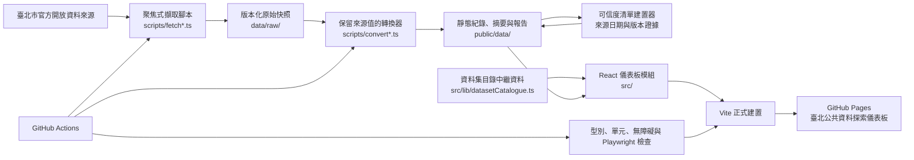
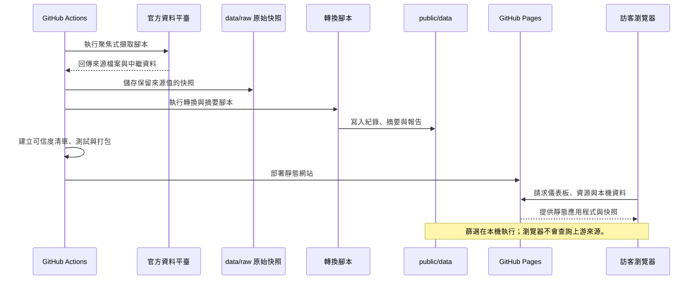

# 臺北公共資料探索儀表板

[English](README.md) · [繁體中文](README.zh-TW.md)

這是一個以 Vite + React 製作的雙語儀表板，用於瀏覽精選的臺北市公共紀錄資料集。它協助使用者尋找來源紀錄、查看資料範圍與新鮮度，並比較描述性摘要；不將公共資料暗示為排名、推薦或即時服務資訊。

## 提供的功能

- 以主題分類與搜尋方式瀏覽 156 個已分類的路由／檢視；Data Trust 追蹤其中 117 個靜態資料目錄。
- 支援繁體中文與英文介面。
- 依資料集提供篩選、來源欄位明細、CSV 匯出，以及來源允許時的外部地址查詢。
- 在建置時產生 Data Trust 資訊：可讀取的來源日期、明確標示的未知日期、沿用快照警示，以及精簡的本機資料與隱私提醒。
- 支援可分享的資料集／語言 URL、持久化 onboarding 狀態、鍵盤可操作的 tabs、路由層級 lazy loading，以及 GitHub Pages 靜態部署。

## 目前版本狀態

A–H 修正與 polish 系列已於 **2026-09-18** 完成 pre-demo verification，驗證 commit 為 `9031db0c3b75eeae7d0bb756b0bd9aee78bf3cb5`。對應的 GitHub Pages workflow 已成功完成最新資料擷取／轉換、typecheck、unit tests、production build，以及桌面與手機 Playwright；結果為 **91 passed / 1 個預期 skip / 0 failed**。

該次部署的 release evidence 顯示：Data Trust 追蹤 **117** 個靜態資料目錄，其中 **32** 個有可讀取來源日期、**85** 個日期未知，且 **0** 個沿用舊快照 fallback。完整紀錄請參閱 [Pre-demo verification — 2026-09-18](docs/pre-demo-verification-2026-09-18.md)，post-demo legacy migration 清單請參閱 [UI family classification](docs/ui-family-classification.md)。

## 資料目錄

### 私有文化資產補助案

`private_cultural_heritage_subsidies` 是臺北市私有文化資產補助案件的本機快照。它保留五個原始欄位，只在可明確判讀時轉換民國／西元年度與核定經費；補助項目分類及名錄名稱、行政區完全一致的比對都會標示為衍生資訊，並非官方認定。更新時依序執行 `npm run data:fetch:private-cultural-heritage-subsidies` 與 `npm run data:convert:private-cultural-heritage-subsidies`。

### 旅遊醫學門診醫院名冊

`travel_medicine_clinics` 是臺北市政府衛生局旅遊醫學門診醫院名冊的本機快照，保留官方聯絡、地址、科別與自費 M 痘接種欄位。「來源列示可自費接種」僅表示來源明確標示，並非即時庫存、預約、資格或價格資訊。更新時依序執行 `npm run data:fetch:travel-medicine-clinics` 與 `npm run data:convert:travel-medicine-clinics`。

### 臺北市客家社團

`hakka_organizations` 是 109 年（2020）臺北市客家社團名冊的本機快照。它保留 CSV 中所有實際欄位，僅呈現來源記錄的名冊資訊；較晚的檔案更新日期不代表社團或理事長／會長資訊已更新至現在。更新時依序執行 `npm run data:fetch:hakka-organizations` 與 `npm run data:convert:hakka-organizations`。

### 出院準備銜接長照服務合作醫院

`hospital_discharge_long_term_care_partners` 是臺北市出院準備銜接長照服務合作醫院的本機快照。據點位置欄位是地址文字，因此僅提供外部地圖查詢，不會地理編碼或建立標記；列入名冊不表示服務可立即安排、具有容量、符合資格或適合特定個案。更新時依序執行 `npm run data:fetch:hospital-discharge-long-term-care-partners` 與 `npm run data:convert:hospital-discharge-long-term-care-partners`。

### 臺北市內科醫療機構

`internal_medicine_institutions` 是臺北市內科醫療機構名冊的本機快照。它保留五個官方欄位，只從地址明確行政區或保守的臺北郵遞區號對照推得行政區，並提供來源更新日期與資料品質標記；這不是即時門診、醫師、預約或次專科服務資訊。更新時依序執行 `npm run data:fetch:internal-medicine-institutions` 與 `npm run data:convert:internal-medicine-institutions`。

### 撤銷裁罰非法旅館業名單

`withdrawn_illegal_hotel_enforcement_records` 是已撤銷或廢止行政裁罰紀錄的本機歷史快照，不是目前非法旅館名單；名稱、地址、日期與來源金額都不可解讀為目前違法或持續責任。更新時依序執行 `npm run data:fetch:withdrawn-illegal-hotel-enforcement-records` 與 `npm run data:convert:withdrawn-illegal-hotel-enforcement-records`。

資料目錄依公共服務主題分類：健康與醫療、社福／家庭／照顧、就業／產業／商業、教育／文化／旅遊、城市服務／環境／生活、動物與寵物，以及探索／比較／說明。

目錄中繼資料位於 [`src/lib/datasetCatalogue.ts`](src/lib/datasetCatalogue.ts)。所有目錄路由／檢視也會透過 [`src/lib/datasetUiFamily.ts`](src/lib/datasetUiFamily.ts) 對應到六個 UI family 之一：`healthcare-standard`、`healthcare-rich-directory`、`location-directory`、`registry-directory`、`records-analysis`、`statistics-analysis`。新增資料集時，除了主要分類與搜尋詞，也應明確確認其 UI family 或適用的分類預設。

### 臺北市殯葬禮儀服務業

`funeral_service_businesses` 是臺北市殯葬禮儀服務業備查核准清冊的本機快照，保留五個官方來源欄位。負責人欄位僅在展開的來源細節中呈現；地址只提供外部查詢，不進行座標化或地圖標記。列入名冊僅代表來源行政登記，並不表示目前營業、服務項目、費用、品質、資格或推薦。更新時依序執行 `npm run data:fetch:funeral-service-businesses` 與 `npm run data:convert:funeral-service-businesses`。

### 臺北市定點臨托

`fixed_site_temporary_childcare` 是臺北市定點臨托服務名冊的本機快照，保留五個官方來源欄位，提供依來源欄位的地點與聯絡篩選，以及外部地址查詢。本模組不表示即時預約、名額、服務時間、年齡限制、費用、資格、安全或服務品質。更新時依序執行 `npm run data:fetch:fixed-site-temporary-childcare` 與 `npm run data:convert:fixed-site-temporary-childcare`。

### 近期公共服務目錄

近期新增專案型健康服務院所（長者肺炎鏈球菌、3 歲以下流感、GBS 篩檢、高度近視防治、腎臟健康、藥癮戒治與網癮服務）、社會福利目錄（急難救助、身心障礙日間服務、兒少福利、早療與銀髮服務）、公共透明度資料（市有財產委託經營、勞工退休金條例裁處、醫療保健福利預算）及環境用藥販賣業者。每個資料集皆有專用的 `data:fetch:<dataset>` 與 `data:convert:<dataset>` 指令，並維持為本機來源快照；不代表即時可用性、資格、品質、排名、現況違規或推薦。

## 快速開始

需求：Node.js 22 與 npm。

```bash
npm ci
npm run dev
```

請開啟 Vite 輸出的本機網址。

## 常用指令

```bash
# 型別檢查、unit tests、瀏覽器流程與正式建置
npm run typecheck
npm test
npm run test:e2e
npm run build

# 僅執行介面無障礙契約測試
npm run test:accessibility

# 重新擷取全部遠端來源並轉換
npm run data:fetch
npm run data:convert
```

`npm run data:fetch` 會大量更新遠端來源，可能一次變更許多公共資料檔案，因此不應作為日常驗證。處理單一目錄時，請優先使用 `data:fetch:<dataset>` 及對應的 `data:convert:<dataset>` 指令。

## 搜尋引擎收錄

正式網站已包含 canonical URL、Open Graph 中繼資料、`DataCatalog` JSON-LD 描述、[`robots.txt`](public/robots.txt) 與 [`sitemap.xml`](public/sitemap.xml)。這些項目讓搜尋引擎與答案引擎更容易辨識唯一的 GitHub Pages 正式網址，但不保證排名或一定收錄。

部署後，已驗證網站擁有權的管理者應將 `https://leo0331.github.io/taipei-civic-groups-map/sitemap.xml` 提交至 Google Search Console 與 Bing Webmaster Tools。資料目錄或內容有重大更新時應重新提交；必要時可在各平台的網址檢查工具要求重新檢索首頁。

建置會執行 `scripts/buildDataTrustManifest.ts`，產生 `public/data/data-trust-manifest.json` 與 `public/data/data-release-summary.json`。

## 新增資料集

1. 新增聚焦的擷取／轉換腳本與來源中繼資料。
2. 依既有的「保留來源值」模式建立目錄模組。
3. 在應用程式中註冊可見標籤與模組。
4. 在 `datasetCatalogue.ts` 指定唯一主要分類；若官方名稱不易搜尋，請加入使用者會使用的搜尋詞。
5. 新增或更新轉換與介面測試。
6. 執行下列完整驗證。

除非公共來源直接證實，請勿推論目前服務可用性、資格、品質、安全、法規遵循、價格或推薦。

## 驗證

建立 pull request 前，先執行與變更相關的 focused checks，再執行：

```bash
npm run typecheck
npm test
npm run test:e2e
npm run build
git diff --check
```

GitHub Pages 工作流程會重新擷取／轉換資料，執行 typecheck、unit tests、桌面／手機 Playwright、production build，接著上傳 release evidence 並部署。可信度清單、版本摘要與轉換報告會保留為部署證據。

## 架構圖



所有呈現的紀錄都是本機資料快照。此圖刻意分開來源收集與瀏覽器呈現：訪客的瀏覽器不會直接呼叫來源系統，儀表板也不宣稱即時服務可用性。

### 更新、建置與瀏覽順序



## 專案結構

```text
src/                 React 模組、目錄／UI family 中繼資料與共用工具
scripts/             來源擷取、轉換與建置期報告
public/data/         產生的本機靜態資料集
.github/workflows/   Frontend CI 與 GitHub Pages 部署工作流程
doc/                 長篇產品與設計決策文件
docs/                release、verification 與操作紀錄
```

## 部署

推送至 `main` 後，會透過 [`.github/workflows/deploy.yml`](.github/workflows/deploy.yml) 部署。正式網站位於 <https://leo0331.github.io/taipei-civic-groups-map/>。

## 重要限制

本網站是公共紀錄的探索工具，不是即時且具權威性的服務名錄。來源日期可能缺漏或已過期，未知日期會刻意揭露。若有地址資料，僅用於可選擇的外部地圖查詢；搜尋與篩選都留在瀏覽器內，但開啟外部地圖時，選取的地址會提供給該地圖服務商。正式版目前的主要 JavaScript chunk 約為 549.5 kB minified / 161.4 kB gzip，因此 Vite 仍會顯示 >500 kB 的提示；資料集模組本身已採路由層級 lazy loading。Playwright 已涵蓋桌面／手機流程與代表性版面限制，但六個 UI family 的完整 screenshot / pixel-diff visual regression baseline 仍屬 demo 後工作。

產品建議與持續風險請參閱[《臺北公共資料儀表板－設計決策與演進方向》](doc/臺北公共資料儀表板－設計決策與演進方向.md)。
